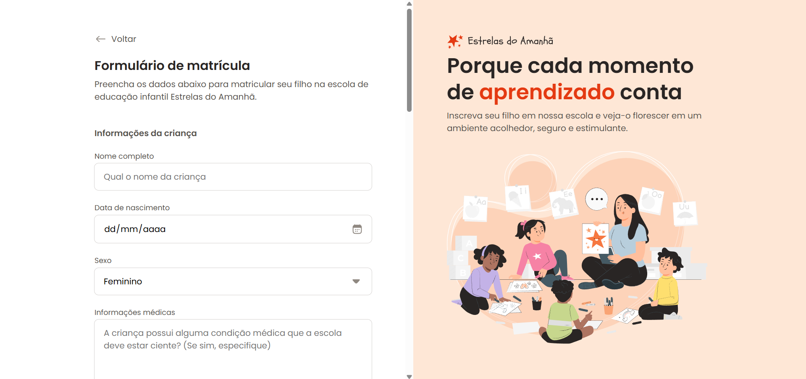

# Registration Form

Registration form created during studies.



## About

This project is a web page featuring a registration form for the preschool "Estrelas do Amanhã". The form includes fields for child information, home address, legal guardian, physical activities of interest, and document upload.

## Tech Stack

- HTML
- CSS

## Design

- [Figma](https://www.figma.com/design/d77p95zSKcct7eVxN6Wzrx/Formul%C3%A1rio-de-matr%C3%ADcula--Community-?m=auto&t=vQVa78DNqtwsdMNq-6)

## How to run

```bash
# Clone this repository
git clone https://github.com/sillasemanoel/study-registration-form

# Enter the project folder
cd study-registration-form

# Open the index.html file in your browser
```

## Author

Sillas Emanoel
